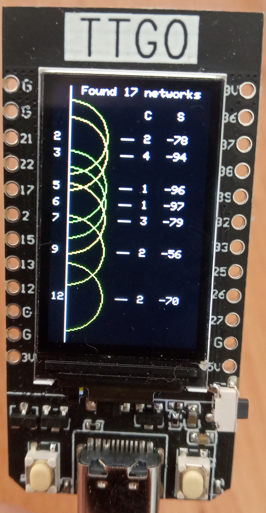

# TTGO-ChannelAnalyzer
A simple WiFi channel analyzer for the ESP32 TTGO T-Displej 1.14"

Are you tired of using quality WiFi channel analyzers on your smartphone? Do you want to carry a device with you everywhere just to get this functionality? Well this project is for you! (/s)

Basically, this software just scans all the WiFi networks, extracts some of their parameters, and prints them out.

The information showed includes:
* The spectral graph of the frequencies with the channel number
* The number of networks using the channel
* The average strength of the networks in that channel

## Requiremenets:
 * [TFT_eSPI library](https://github.com/Bodmer/TFT_eSPI)
 * [LilyGO TTGO 1.14" Board](https://www.laskarduino.cz/lilygo-ttgo-t-displej-esp32-1-14-tft-wifi-modul/)
